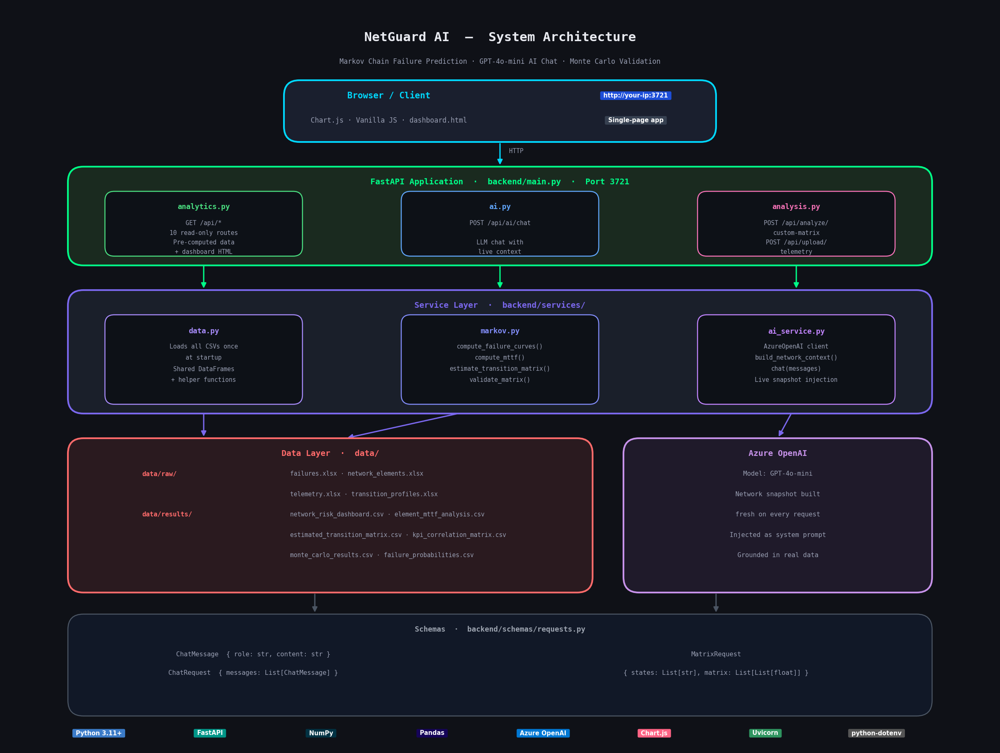

<div align="center">

# 🔮 NetGuard AI
### Predictive Network Intelligence Platform

**Markov Chain failure prediction · GPT-4o-mini AI chat · Monte Carlo validation**


---

*Monitors 500 telecom network devices in real-time, predicts failures up to 24 hours in advance,*
*and lets your NOC team ask questions in plain English.*

</div>

---

## What This Does

NetGuard AI applies **Markov Chain state modelling** to telecom network telemetry.
Every device moves through five health states — `Healthy → Warning → Minor → Major → Failure` —
and the system computes the exact probability of each device failing within 1h, 6h, 24h, and 7 days.

The result is a live dashboard that tells your NOC team **which device will fail next, in which region, and exactly what to do**.

| Metric | Value |
|---|---|
| Network elements monitored | 500 (RAN · OPTICAL · EDGE · CORE) |
| Telemetry records | 168,000 hourly readings · Aug 1–14, 2025 |
| Failure events | 4,284 |
| Model accuracy | **99.8%** — Markov analytical vs Monte Carlo (5,000 simulations) |
| Advance warning window | Up to **24 hours** before failure |
| Availability improvement | 87.5% → 95.0% (estimated, 60% failure prevention rate) |

---

## Key Features

**Predictive Analytics**
- Per-device failure probability at 1h / 6h / 24h / 7-day horizons
- Flags devices that *look healthy* but are statistically HIGH risk — catches what a human NOC would miss
- MTTF (Mean Time to Failure) computed via absorbing Markov chain fundamental matrix `N = (I−Q)⁻¹`
- Priority Action Board with urgency tiers: **DISPATCH NOW · ACT WITHIN 12H · SCHEDULE TODAY**

**AI Assistant**
- GPT-4o-mini chat widget embedded in the dashboard
- Live network snapshot (risk distribution, top at-risk devices, KPI correlations) injected into every prompt
- Answers in plain English — built for NOC operators, not data scientists

**Interactive Analysis**
- **Custom Matrix Analyzer** — modify any transition probability and instantly see how failure curves and MTTF change
- **Telemetry CSV Upload** — upload your own device state history; the system estimates a Markov matrix using MLE and runs the full analysis on your data
- **Monte Carlo cross-validation** — 5,000 simulation runs vs analytical model, shown side by side

**Dashboard**
- Real-time IST clock, live status alert bar
- KPI correlation heatmap · State transition heatmap
- Failure probability curves over 168h · MTTF bar charts by type and region
- Paginated, searchable, filterable table of all 500 elements

---

## Architecture

<div align="center">



</div>

### Request Flow

| Request type | Path |
|---|---|
| **Analytics** | `GET /api/*` → `analytics.py` → `data.py` (read DataFrame) → JSON → Chart.js |
| **AI Chat** | `POST /api/ai/chat` → `ai.py` → `ai_service.build_network_context()` → Azure OpenAI → reply |
| **Custom Matrix** | `POST /api/analyze/custom-matrix` → `markov.validate_matrix()` → `compute_failure_curves()` → `compute_mttf()` |
| **Telemetry Upload** | `POST /api/upload/telemetry` → parse CSV → `estimate_transition_matrix()` → full analysis |

---

## Project Structure

```
netguard-ai/
│
├── run.py                        ← Entry point  (python run.py)
├── requirements.txt
├── .env.example                  ← Key template — copy to .env
├── .gitignore
├── README.md
├── architecture.png              ← System architecture diagram
│
├── backend/
│   ├── main.py                   ← App factory: middleware + router wiring
│   ├── config.py                 ← Single source of truth: env vars, paths, constants
│   │
│   ├── api/                      ← HTTP layer (routing only, no business logic)
│   │   ├── analytics.py          ← GET /api/* — 10 read-only endpoints
│   │   ├── ai.py                 ← POST /api/ai/chat
│   │   └── analysis.py           ← POST /api/analyze/* and /api/upload/*
│   │
│   ├── services/                 ← Business logic (no FastAPI imports)
│   │   ├── data.py               ← CSV loading + shared DataFrame helpers
│   │   ├── markov.py             ← Pure math: failure curves, MTTF, MLE estimation
│   │   └── ai_service.py         ← Azure OpenAI client + network context builder
│   │
│   └── schemas/
│       └── requests.py           ← Pydantic request models
│
├── frontend/
│   └── dashboard.html            ← Single-page dashboard (Chart.js, no framework)
│
└── data/
    ├── raw/                      ← Source Excel files (analysis input)
    │   ├── failures.xlsx
    │   ├── network_elements.xlsx
    │   ├── telemetry.xlsx
    │   └── transition_profiles.xlsx
    │
    └── results/                  ← Pre-computed CSV outputs (loaded at startup)
        ├── network_risk_dashboard.csv
        ├── element_mttf_analysis.csv
        ├── estimated_transition_matrix.csv
        ├── kpi_correlation_matrix.csv
        ├── monte_carlo_results.csv
        └── failure_probabilities.csv
```

---

## Quick Start

```bash
# 1. Clone the repository
git clone https://github.com/zeeshanparwez/netguard-ai.git
cd netguard-ai

# 2. Create and activate a virtual environment
python -m venv venv
source venv/bin/activate        # Windows: venv\Scripts\activate

# 3. Install dependencies
pip install -r requirements.txt

# 4. Set up environment variables
cp .env.example .env
# Edit .env and replace placeholder values with your Azure OpenAI credentials

# 5. Start the server
python run.py
# or: uvicorn backend.main:app --host 0.0.0.0 --port 3721 --reload

# 6. Open the dashboard
# http://localhost:3721
```

> **No Azure OpenAI key?** Every chart, table, Markov analysis, and CSV upload feature works without any key.
> Only the 💬 AI chat widget in the bottom-right corner requires Azure OpenAI credentials.

---

## API Reference

**Base URL:** `http://localhost:3721`  
**Interactive docs:** `http://localhost:3721/docs`

### Analytics — Pre-computed Data

| Method | Endpoint | Description |
|---|---|---|
| `GET` | `/` | Serves the dashboard HTML |
| `GET` | `/api/summary` | Risk & state distribution, avg MTTF, breakdown by type & region |
| `GET` | `/api/elements` | Paginated element table — supports filter, sort, search |
| `GET` | `/api/transition-matrix` | 5×5 Markov hourly transition matrix |
| `GET` | `/api/kpi-correlation` | 6×6 Pearson KPI correlation matrix |
| `GET` | `/api/failure-curves` | 168h cumulative failure probability per starting state |
| `GET` | `/api/mttf-breakdown` | MTTF mean/min/max by device type and region |
| `GET` | `/api/monte-carlo` | Analytical model vs 5,000-run Monte Carlo cross-validation |
| `GET` | `/api/business-impact` | ROI: reactive vs predictive maintenance comparison |
| `GET` | `/api/priority-actions` | Top 10 highest-risk pre-failure devices + recommended actions |

### Interactive — Live Computation

| Method | Endpoint | Description |
|---|---|---|
| `POST` | `/api/ai/chat` | GPT-4o-mini chat with live network context in the system prompt |
| `POST` | `/api/analyze/custom-matrix` | Any 5×5 matrix → failure curves + MTTF (what-if analysis) |
| `POST` | `/api/upload/telemetry` | CSV of state observations → estimate matrix → full analysis |
| `GET`  | `/api/sample-csv` | Download the CSV template for the upload endpoint |

---

## Interactive Features

### Custom Matrix Analyzer

Modify any transition probability in the dashboard and click **Analyze** to instantly see how failure curves and MTTF respond. Useful for answering: *"If I improve the RAN → Failure rate by 15%, how much does availability improve?"*

You can also POST directly to the API:

```json
POST /api/analyze/custom-matrix
{
  "states": ["Healthy", "Warning", "Minor", "Major", "Failure"],
  "matrix": [
    [0.90, 0.06, 0.02, 0.01, 0.01],
    [0.20, 0.62, 0.12, 0.04, 0.02],
    [0.06, 0.25, 0.53, 0.12, 0.04],
    [0.02, 0.07, 0.24, 0.51, 0.16],
    [0.00, 0.00, 0.00, 0.00, 1.00]
  ]
}
```

Each row must sum to `1.0` (±0.02 tolerance). No negative values.

**Returns:** Failure probability curves over 168h · MTTF per starting state · 24h and 7-day failure probabilities.

---

### Telemetry CSV Upload

Upload your own device state history and the system estimates a Markov transition matrix using **maximum likelihood estimation** — no manual probability entry required.

**CSV format:**

```csv
element_id,state
NE001,Healthy
NE001,Warning
NE001,Minor
NE001,Failure
NE002,Healthy
NE002,Warning
NE002,Healthy
```

| Column | Required | Description |
|---|---|---|
| `state` | ✅ Yes | One of: `Healthy` · `Warning` · `Minor` · `Major` · `Failure` |
| `element_id` | Optional | If present, transitions are computed *within* each device — no bleed across boundaries |

Download the template: `GET /api/sample-csv`  
Minimum recommended: **~50 state observations** for a stable matrix estimate.

---

## Configuration

Copy `.env.example` to `.env` and fill in your credentials:

```env
# Azure OpenAI — required only for the AI chat widget
AZURE_API_KEY=your-api-key-here
AZURE_API_BASE=https://your-resource-name.openai.azure.com/
AZURE_API_VERSION=2024-10-21
AZURE_DEPLOYMENT_NAME=gpt-4o-mini
```

Get these from: **Azure Portal → Azure OpenAI → Your Resource → Keys and Endpoint**

---

## Tech Stack

| Layer | Technology | Purpose |
|---|---|---|
| API framework | FastAPI + Uvicorn | REST endpoints, CORS, file serving |
| Markov math | NumPy | Matrix operations, fundamental matrix MTTF, MLE estimation |
| Data handling | Pandas | CSV loading, groupby, filtering, pagination |
| AI | Azure OpenAI GPT-4o-mini | Natural language Q&A with live network context |
| Frontend | Vanilla JS + Chart.js 4 | No framework — single self-contained HTML file |
| Config | python-dotenv | `.env` loading at startup |
| File upload | python-multipart | Multipart form parsing for CSV uploads |

---

## How the Markov Model Works

Each network element transitions between five health states every hour. The transition matrix `P` (estimated from 167,500 observed transitions) captures the hourly probability of moving between states.

```
States:  Healthy → Warning → Minor → Major → Failure
                                               ↑
                                         Absorbing state
```

**MTTF** is computed from the fundamental matrix of the absorbing chain:

```
Q  = transient × transient sub-matrix of P
N  = (I − Q)⁻¹            ← fundamental matrix
t  = N · 1                 ← expected steps before absorption
MTTF[state] = t[state]    (in hours)
```

**Failure curves** are computed by iterating `vec = vec @ P` for 168 steps, accumulating the probability mass that lands in the Failure state at each step.

The model is cross-validated against 5,000 Monte Carlo simulations — **99.8% match**.

---

<div align="center">

Built by **Zeeshan Parwez** · Powered by Markov Chain Theory & Azure OpenAI

</div>
